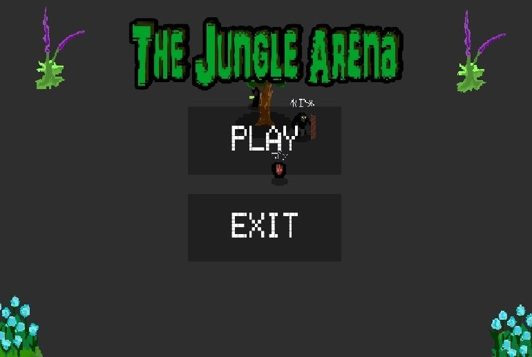
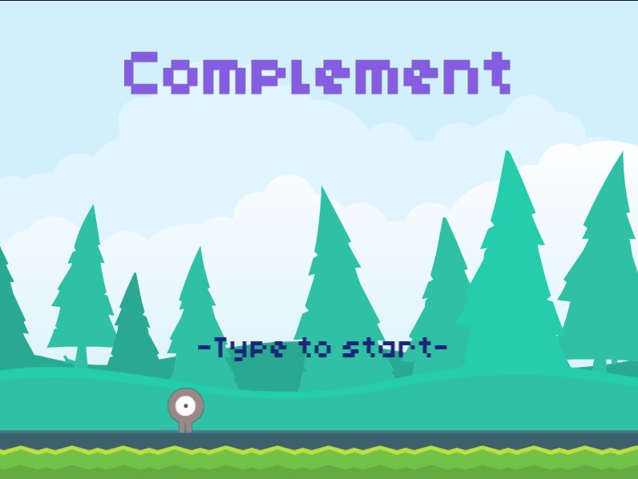

---

# Portfolio

- TRINH KIET
- 専門学校デジタルアーツ東京 ゲームプログラムコース 2026年卒業予定

## 資格
- 

## スキル
- C#
  - 利用歴半年
  
- Unity
  - 利用歴半年
  
- C/C++
  - 利用歴半年
 

## 取り組んでいるテーマ
1. オリジナルゲーム開発
2. 基本情報処理の内容を活用するゲーム制作事例の調査
3. 基本情報処理に関連する数学やアルゴリズムの仕組みを試せるアプリの開発

## 作品リスト

### Jungle arena 

1v1対戦型ゲーム

開発環境：Unity2021.3.4f1

開発期間：2024/10/18-11/8

アイテムスポーンのコードやアセット作成など。

### Complement

横スクロール型探索ゲーム

開発環境：GDevelop 5

開発期間：2024/8/26-28

設定や組み立て、編集全般。

## 連絡先
メール<engtrinhduyam@gmail.com>

